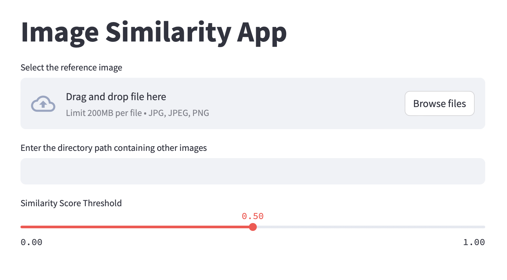
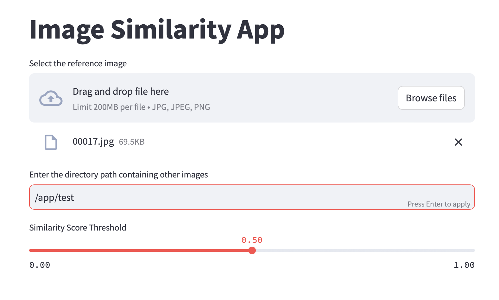
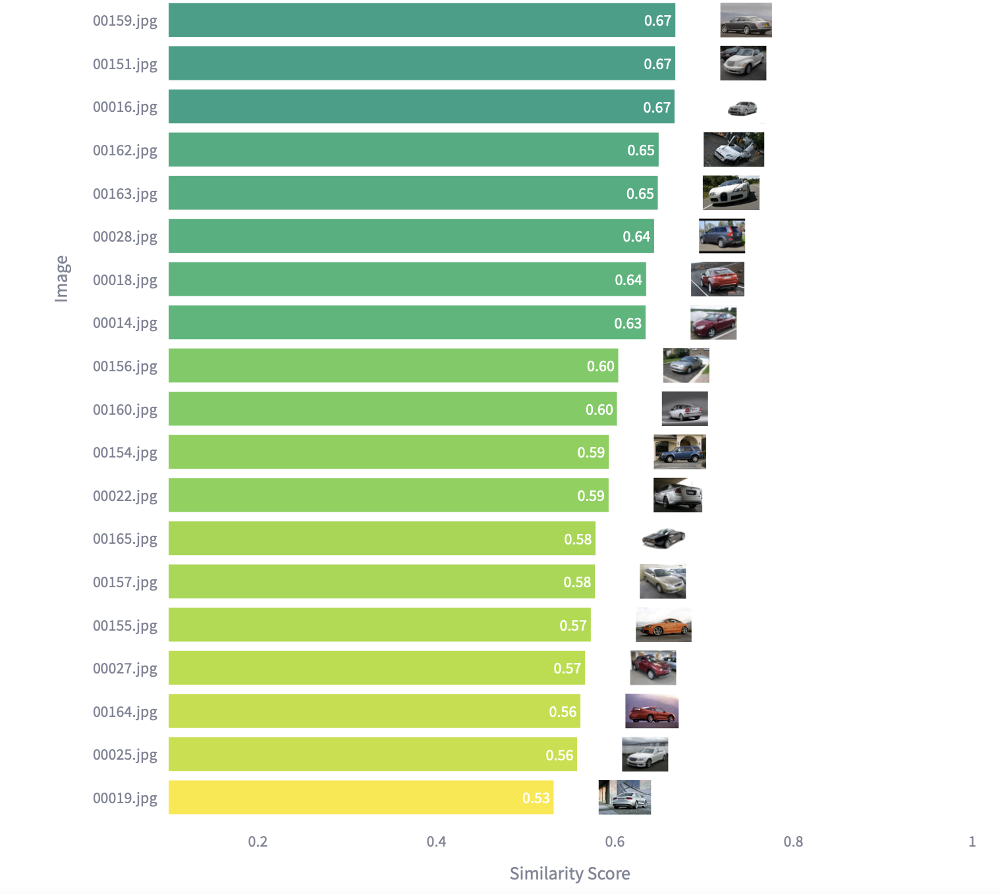

# Image Similarity Search

Find similar images by giving a reference image.



This project implements an image similarity search application using a FastAPI backend and a Streamlit frontend. The application allows users to upload a reference image and a directory of other images, and it retrieves the most similar images based on a specified similarity threshold.

## Features

- Upload a reference image and a directory of other images
- Calculate image embeddings using a pre-trained ResNet50 model
- Compute similarity scores between the reference image and other images
- Display the most similar images based on a user-defined similarity threshold
- Visualize similarity scores using a bar chart with thumbnail images

## Installation

### Using Docker (Recommended)

1. Make sure you have Docker and Docker Compose installed on your system.

2. Clone the repository:
```
git clone https://github.com/sukumar45/image_similarity_search.git
```
3. Navigate to the project directory:
```
cd image_similarity_search
```
4. Pull the Docker images for the API and client:
```
docker pull sukumar2112/image_similarity_search:api
docker pull sukumar2112/image_similarity_search:client
```
5. Start the application using Docker Compose:
```
docker-compose up
```
6. Open a web browser and go to [http://localhost:8501](http://127.0.0.1:8501) to access the Streamlit application.

### Manual Installation

1. Clone the repository:
```
git clone https://github.com/sukumar45/image_similarity_search.git
```
2. Navigate to the project directory:
```
cd image_similarity_search
```
3. Install the required dependencies for the FastAPI backend:
```
cd api
pip install -r requirements.txt
```
4. Install the required dependencies for the Streamlit frontend:
```
cd ../client
pip install -r requirements.txt
```

## Usage

### Using Docker Compose

1. Start the application using Docker Compose:
```
docker-compose up
```
2. Open a web browser and go to [http://localhost:8501](http://127.0.0.1:8501)  to access the Streamlit application.

### Manual Usage

1. Start the FastAPI backend:
```
cd api
uvicorn main:app --reload
```

2. In a new terminal, start the Streamlit frontend:
```
cd client
streamlit run streamlit_client.py
```
3. Open a web browser and go to [http://localhost:8501](http://127.0.0.1:8501) to access the Streamlit application.

4. Upload a reference image using the file uploader.
5. Enter the directory path containing the other images you want to compare.
6. Adjust the similarity score threshold using the slider.
7. The application will display the most similar images based on the selected threshold.
8. A bar chart will visualize the similarity scores along with thumbnail images.

## Example Usage



1. Upload a reference image.
2. Enter the directory path containing a collection of animal images. (Set directory path to `/app/test` when using docker-compose to use the included test directory)
3. Set the similarity score threshold to 0.7.
4. The application will display the most similar images from the provided directory.


5. The bar chart will show the similarity scores and thumbnails of the retrieved images.



## Next steps

1. Add a prompt box to take user prompts to filter the images.


## Project Structure

- `api/`: Contains the FastAPI backend code and model weights.
-    `main.py`: FastAPI application entry point.
-    `model.py`: Image embedding generation using ResNet50.
-    `resnet50-11ad3fa6.pth`: Pre-trained ResNet50 model weights.
- `client/`: Contains the Streamlit frontend code.
-    `test`: Folder containing images for testing the app
-    `streamlit_client.py`: Streamlit application code.

## Contributing

Contributions are welcome! If you find any issues or have suggestions for improvement, please open an issue or submit a pull request.

## License

This project is licensed under the [MIT License](LICENSE).


